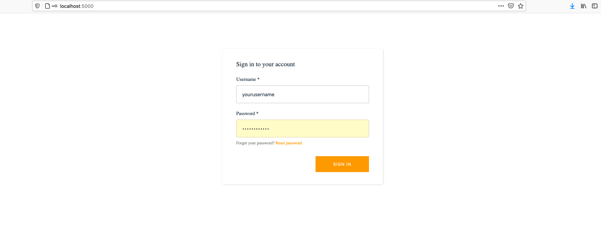
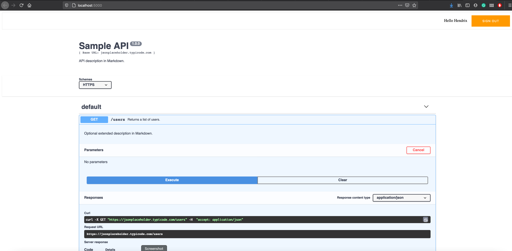

> This project was bootstrapped with [Create React App](https://github.com/facebook/create-react-app).

# Internal Swagger docs

Why the word `internal`? because this webpage is protected by aws cognito service, review the *env.sample* file to make sure you are setting the proper aws cognito credentials that will generate the login page like this: 

and page (swagger definition hosted):

## Replace swagger spec file

In the folder `src/spec` there is swagger spec sample, replace it by your own 😉. 

## Documentation

Checkout my [blog post](https://noiselesstech.net/how-to-secure-swagger-documentation-for-internal-apis) about.
